# VersusPad

This is a collection of the VersusPad iPad and Android tablet apps & games For Two (with some single-player games thrown in). The idea is that two people sit around the same tablet and play or communicate with each other. These apps were playtested mainly in bars and cafes in China, with thanks to everyone participating! Some of these apps were created using Corona (Lua), others use Phonegap (JavaScript).

&nbsp;

<a href="https://www.youtube.com/watch?v=QBRmL7YXCZ8">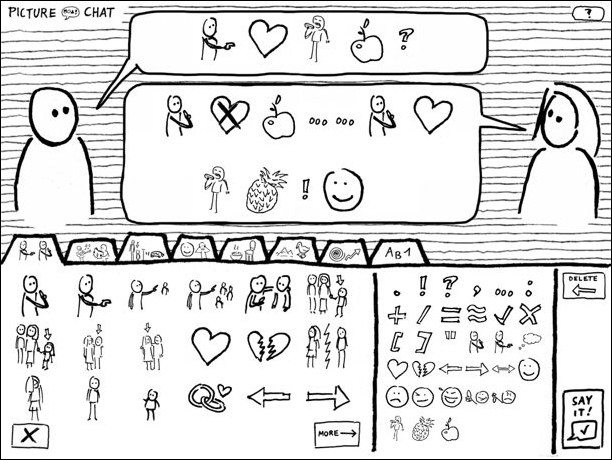</a>

In Picture Chat, two people communicate with each other through a symbol language, without saying a word. (Click on screenshots to view the video.)

&nbsp;

<a href="https://www.youtube.com/watch?v=QBRmL7YXCZ8">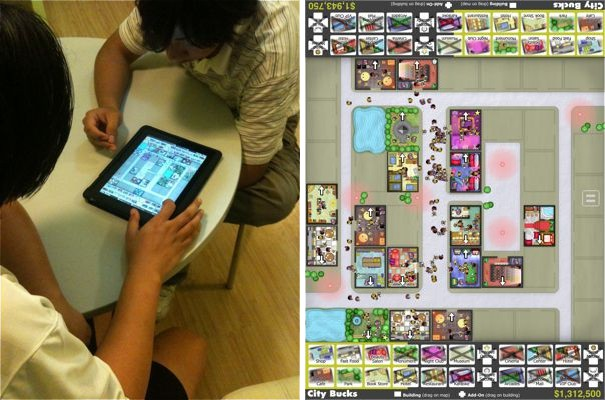</a>

In City Bucks, two people try to entertain the most citizens by building in the same city. The core algorithm behind this is that each of the citizens has Wants -- like Shopping, Culture, Food, Sleep, Privacy -- and buildings can then satisfy those at different levels, while creating new Wants (Sleep and Money, which makes the citizens go back home to work and rest). The environment in which a building is placed is critical to its success, as all else equal, citizens will look for the closest building that best satisfies their needs... provided it's not currently overcrowded!

&nbsp;

<a href="https://www.youtube.com/watch?v=7d-lloPAxio">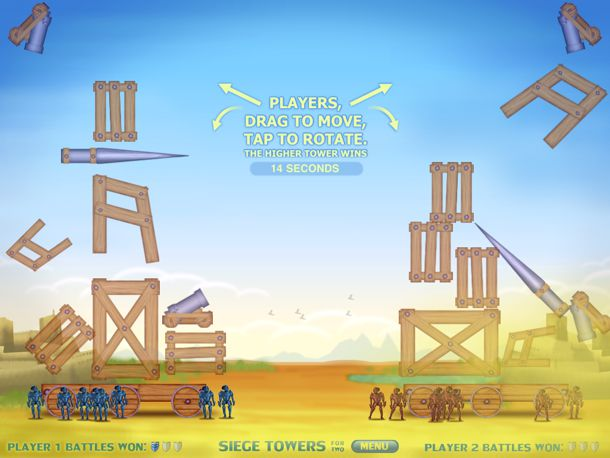</a>

In Siege Towers for Two, which gained over 500,000 downloads in the Apple App Store, two local players compete in building -- and having still stand after the attack -- the highest physics tower using randomized blocks. The simple, quick rounds were optimized to be played in cafes and bars, quickly dropping the iPad on the table and having a fun go.

&nbsp;

<a href="https://www.youtube.com/watch?v=p9uV3e--_A4">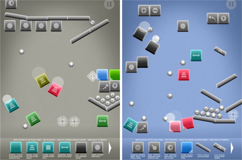</a>

Color Sound Machine lets you freely create settings of rythm, melody and color. Special blocks like teleporters, magnets, speed-ups, octave-changers and more affect the outcome.

&nbsp;

<a href="https://www.youtube.com/watch?v=z8puWWC5zFY">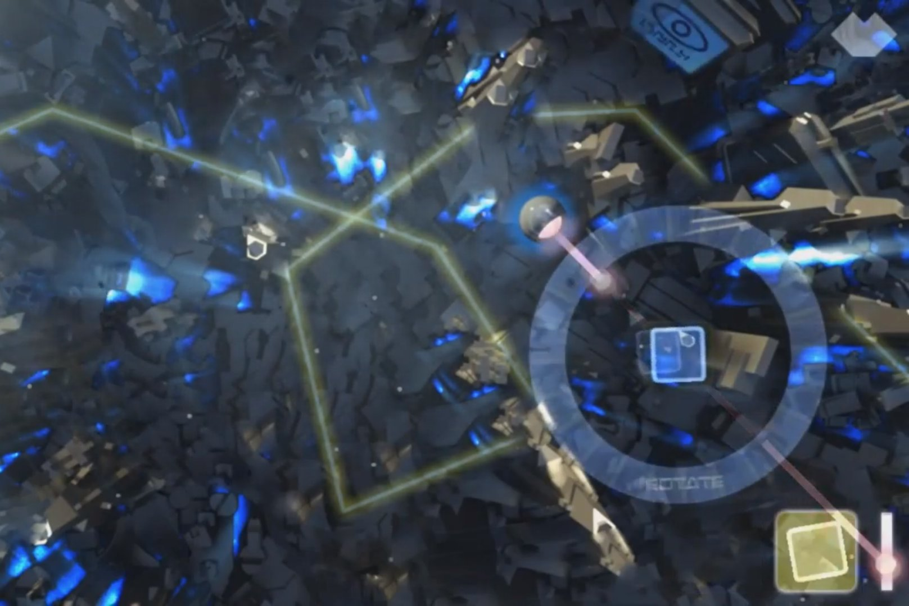</a>

In Uprise, you use special blocks (like bouncers) to divert enemy tower bullets against their own drones to -- attacking by defending. 3d graphics by Marcos Zevallos.

&nbsp;

<a href="https://www.youtube.com/watch?v=0HjF7HG5llk">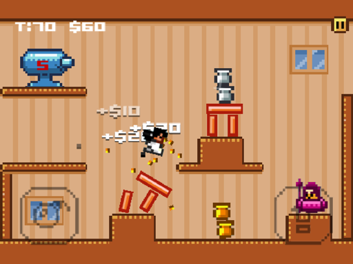</a>

Karate Girl Destruction Run is an endless, randomly-generated, one-tap-play pixel art runner for mobile.

&nbsp;

<a href="https://www.youtube.com/watch?v=YToJC2teqrM">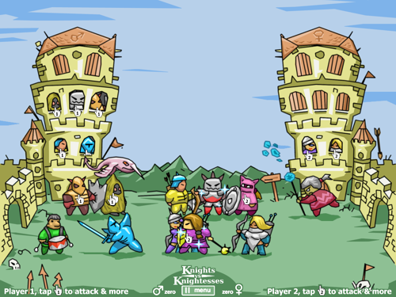</a>

In Knights vs Knightesses, each player taps the characters in their tower, once their window opens (that is, once the energy level affords them). They will then leave the tower to attack the opposing player. Each character has different properties, for instance, the drummer will increase the speed of all other knights, whereas the bow shooter will stand to attack from afar.

&nbsp;

<a href="https://www.youtube.com/watch?v=kLVf_GB-q_Y">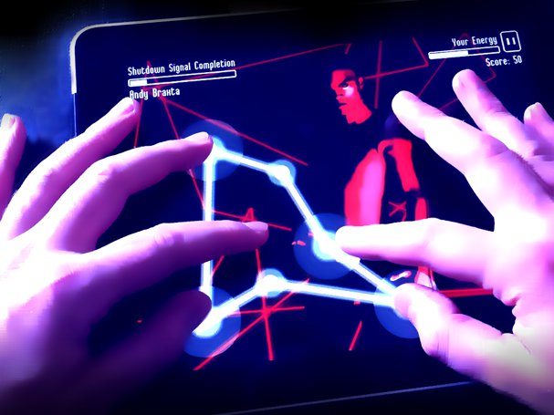</a>

In The Signal, the challenge is to recreate fast with all of your fingers a shown combination pattern, resulting in an enemy hit. New enemies create different sorts of patterns.

&nbsp;

<a href="https://www.youtube.com/watch?v=LbGMSVxH7lQ">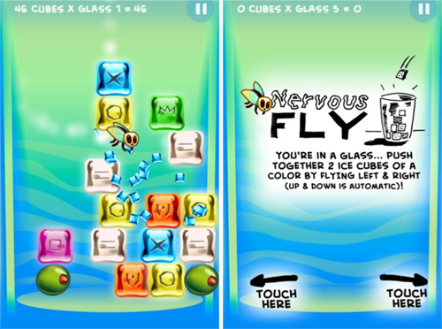</a>

In Nervous Fly, you can only steer left and right -- but the fly in the cocktail glass will automatically choose its rather unpredictable up and down velocity. It's a physics-based match-3 game with a twist.

&nbsp;

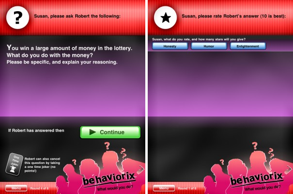

Behaviorix is a party game where players take turns to answer mind probing questions.

&nbsp;

<a href="https://www.youtube.com/watch?v=QvLRKpW8jCU">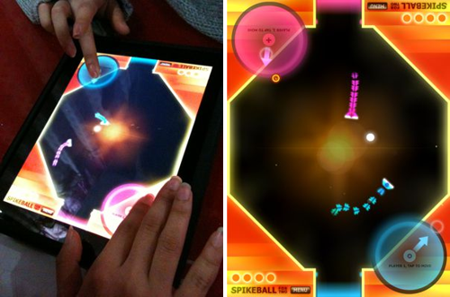</a>

Spikeball For Two has two players battling it out in a soccer-like arena with two goals -- but careful, as the tail of each player is deadly! Different extras can be picked up to change the scenery temporarily.

&nbsp;

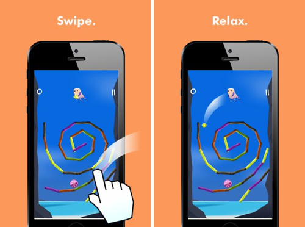

Swipe to throw and clear all bars of the same color in this never-ending game of Beeps. It's relaxing at the start, but the bars (with always changing patterns) will move upwards faster and faster over time!

&nbsp;

<a href="https://www.youtube.com/watch?v=-gZQE4g-uPA">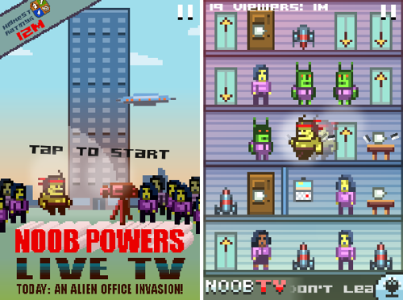</a>

Noob Powers Live TV is a hectic, one-tap action game in which not only do you try to fend of an alien invasion inside the office tower -- you also try to increase your ratings, as it's all a live (and speech-commented) television event!

&nbsp;

<a href="https://www.youtube.com/watch?v=W7TJRfZYpy4">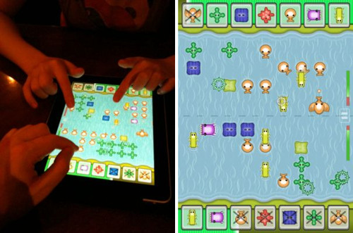</a>

In this fast-paced strategic action game for the iPad, you and a friend sitting next to you each control an island shore with a set of creatures called Ogs. Drop them in the water with a single tap of your finger, then hope they'll reach the opposing shore of your friend, and make use of each of the Ogs' different skills like shooting, blocking, ring-making or flying!

&nbsp;

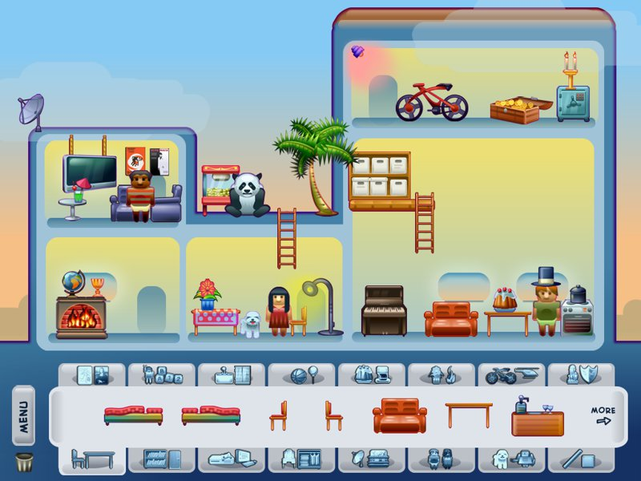

Create the place of your dreams... with full dragging freedom if you want to play out your stories within it. Imagine having a house, ship, space station or island... then selecting from hundreds of items to fill it through simple tap-movement.

&nbsp;

<a href="https://www.youtube.com/watch?v=6rW94ry-7q4">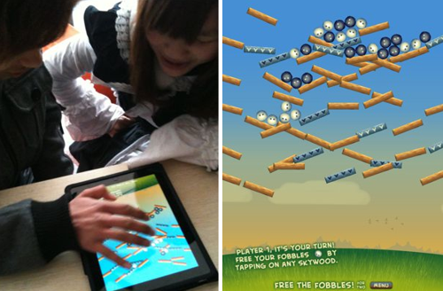</a>

In Free the Fobbles, your goal is to beat your opponent in having all the fuzzy Fobble balls fall down the platform structure. In each turn, you can delete just 1 platform and have the physics unfold the rolls & falls -- but be careful, as you may also free competing Fobbles, as they all occupy the same space!

&nbsp;

Also see <a href="http://versuspad.com">VersusPad.com</a>
